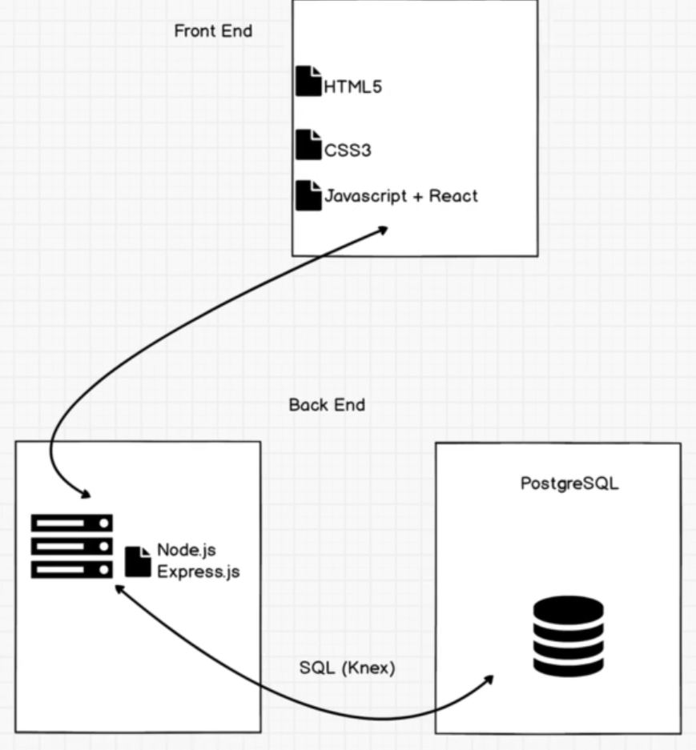
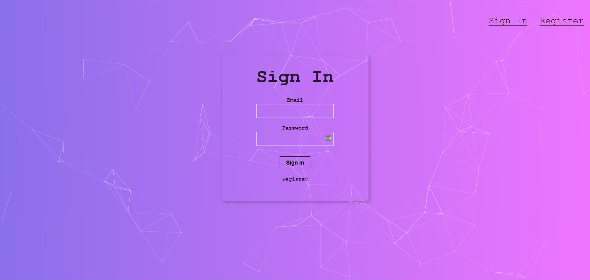

  <a href="https://github.com/othneildrew/Best-README-Template">
    
  </a>
  <h2 align="center">SmartBrain</h2>
  <h3 align="center"></h3>
  

    An fullstack website that implemented face recognition API.  
    <a href="https://smartbrain31.herokuapp.com/">View Demo</a>
    ·
  

<!-- TABLE OF CONTENTS -->
## Table of Contents

* [About the Project](#about-the-project)
  * [Built With](#built-with)
* [Background Introduction](#getting-started)
  * [Prerequisites](#prerequisites)
  * [Installation](#installation)
* [Usage](#usage)
* [Roadmap](#roadmap)
* [Contributing](#contributing)
* [License](#license)
* [Contact](#contact)
* [Acknowledgements](#acknowledgements)

<!-- ABOUT THE PROJECT -->
## About The Project

This project is using the Face recognition API from <a href="https://www.clarifai.com/">clarifai</a>. The techniques of front-end mostly is using react.js from javascript. The back-end side, I use node.js to impelement it. For the database, I use PostgreSQL. Finally, using Heroku to deploy the app.

This is the blueprint of the project.  

### Built With
There are the major library, framework or techniques I use for this project
 
Front-end: 
* [HTML/HTML5](https://www.w3schools.com/html/)
* [CSS3](https://www.w3schools.com/css/default.asp)
* [SemanticUI](https://semantic-ui.com/)
* [JavaScript](https://www.javascript.com/)
* [HTTP/JSON/AJAX](https://www.json.org/json-en.html)
* [React](https://reactjs.org/)
 
Back-end 
 

* [Node.js](https://nodejs.org/en/)
* [bcrypt-nodejs](https://www.npmjs.com/package/bcrypt-nodejs)
* [Express.js](https://expressjs.com/)
* [NPM](https://www.npmjs.com/)
* [PostMan](https://www.getpostman.com/)
 
Database: 

* [PostgreSQL](https://www.postgresql.org/)
* [PgAdmin](https://www.pgadmin.org/)
 
Deploy: 

* [Heroku](https://www.heroku.com/)

<!-- GETTING STARTED -->
## Background Introduction
React is the most popular javascript library for web developing. Although I did websites before, the techniques was outdated such as PHP, MS-SQL. In order to get familiar to the latest technique, I learn react from online resources and did this project.

<!-- CONTACT -->
## Contact

YuYu Ko - [@LinkedIn](https://www.linkedin.com/in/yu-yu-ko-99262a149/) - yuyu.ko@outlook.com

Project Link: [https://github.com/KoYuYu/SmartBrain_frontend](https://github.com/your_username/repo_name)

